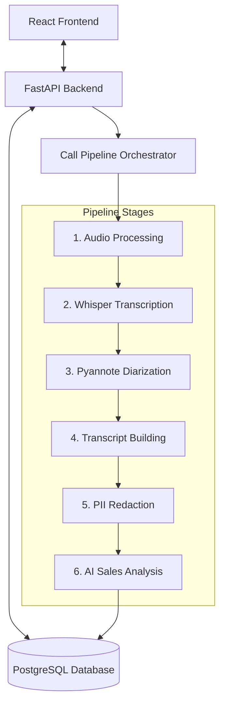

# FitNova Sales Intelligence

## What It Does
FitNova Sales Intelligence is an AI-powered enterprise compliance and performance auditing platform for sales operations. It automatically ingests and normalizes sales call audio, transcribes conversations with speaker diarization, redacts PII for privacy, and analyzes transcripts using LLMs to flag compliance issues and generate scores. An immutable feedback system ensures manager corrections are saved as audit logs, enabling a human-in-the-loop review cycle.

## Architecture



## Quick Start
To set up and run the entire application with database migrations and seeded demo data in one command, run:
```powershell
.\start.ps1
```

## Prerequisites
* **OS**: Windows (for `start.ps1` script execution; manual commands run on Linux/macOS)
* **Python**: v3.11 or v3.12 (with pip)
* **Node.js**: v18 or newer
* **npm**: v9 or newer
* **PostgreSQL**: Installed, running locally, and configured with credentials in `.env`
* **FFmpeg**: Installed and configured in system `PATH` (required by Whisper and Pyannote for audio parsing)

## Environment Setup
1. Copy the template:
   ```bash
   cp backend/.env.example backend/.env
   ```
2. Configure credentials in `backend/.env`:
   * Set database connection parameters (`POSTGRES_USER`, `POSTGRES_PASSWORD`, etc.)
   * Set LLM provider preferences (`LLM_PROVIDER=groq` or `openai` and add keys)
   * Configure the Hugging Face authentication token (`HF_TOKEN`) required for Pyannote speaker diarization

### Mode Configurations
* **REAL AI MODE**:
  * Set `WHISPER_MOCK=False`
  * Set `DIARIZATION_MOCK=False`
  * Ensure valid `HF_TOKEN`, `GROQ_API_KEY`/`OPENAI_API_KEY`, and local FFmpeg setup.
* **MOCK MODE**:
  * Set `WHISPER_MOCK=True`
  * Set `DIARIZATION_MOCK=True`
  * Bypasses heavy local model compute and uses realistic mock outputs for quick testing.

## Run the Application

### Setup Command (Windows)
```powershell
.\start.ps1
```
This script will verify prerequisites, install venv/node_modules, apply Alembic migrations, seed mock advisors/teams, and open two new terminal windows running the backend and frontend dev servers.

### Manual Fallback Setup (Cross-platform/Debugging)

#### 1. Backend Setup:
```bash
cd backend
python -m venv venv

# Activate Virtual Environment:
# On Windows:
.\venv\Scripts\Activate.ps1
# On Linux/macOS:
source venv/bin/activate

pip install -r requirements.txt

# Run migrations:
alembic upgrade head

# Run seed script (idempotent):
python seed.py

# Start Server:
python -m uvicorn app.main:app --reload
```

#### 2. Frontend Setup:
```bash
cd frontend
npm install
npm run dev
```

## Try the Demo with Included Sample Calls

The repository contains pre-loaded audio files inside the `sample_calls/` directory:

| File | Purpose / Test Scenario |
|---|---|
| `fitnova_demo(1)_call.mp3` | **Standard English Sales Call**: Tests normal end-to-end sales analysis. Contains critical compliance issues like guaranteed outcomes, high-pressure closing, and undisclosed costs. |
| `fitnova_demo(non_sale)_call.mp3` | **Non-Sales Query**: Tests the classifier's ability to identify general queries and route them to `Failed` or flag as non-sales. |
| `fitnova_demo(Hinglish)_call.mp3` | **Hinglish Call**: Tests code-switching (mix of Hindi and English) transcription accuracy. |
| `fitnova_demo(Multi_lang_support)_call.mp3` | **Multilingual Support Call**: Mixed Kannada and English audio to test language identification. |

## End-to-End Processing Flow
1. **Ingestion**: Accepts file upload or webhook adapter with idempotency validation.
2. **Audio Standardizing**: Pydub/FFmpeg standardizes file to 16kHz mono WAV format.
3. **Transcription**: Whisper `base` translates speech to raw text.
4. **Speaker Diarization**: Pyannote separates voice channels and stamps speaker blocks.
5. **PII Redaction**: MS Presidio scrubs names, phone numbers, and credentials.
6. **AI Scorecard & Compliance**: LLM audits compliance, flags issues with quotes, and outputs scores.
7. **Human Review**: Manager edits/rejections logged as audit trails without destroying original AI outputs.

## What Is Real vs Mocked

| Component | Prototype Mode | Notes |
|---|---|---|
| **Audio ingestion** | Real | Accepts uploads of raw audio formats (.mp3, .wav, .m4a) up to 50MB. |
| **PostgreSQL storage** | Real | Persistent relational storage using SQLAlchemy ORM (all tables). |
| **Whisper transcription** | Real | Employs local OpenAI Whisper `base` model running on CPU (FP32). |
| **Speaker diarization** | Real | Employs `pyannote/speaker-diarization-3.1` model with a clustering threshold of 0.55. |
| **PII redaction** | Real | Uses Microsoft Presidio for structured regex and NER scrubbing before LLM submission. |
| **AI sales analysis** | Real | Submits sanitized transcripts to Groq/OpenAI to generate scorecard metrics and tag compliance issues. |
| **Telephony Simulator** | Simulated source | Simulates external dialer webhooks via actual HTTP multipart form ingestion. |
| **Production queue** | Not implemented | Local ThreadPoolExecutor and BackgroundTasks are used instead of a Celery/Redis queue for simplicity. |

## Key Engineering Decisions
* **Source-Agnostic Ingestion**: Canonical API models normalize manual files, telephony webhooks, and folders into a unified schema.
* **Database-Driven Idempotency**: Prevents concurrent duplicate runs by atomically claiming jobs via DB locks, and filters duplicate requests using external transaction references (HTTP 409).
* **Asynchronous Thread Pool Offloading**: Offloads CPU-heavy speech tasks (Whisper/Pyannote) to background workers so the main server loop remains responsive.
* **Evidence-Grounded Tagging**: AI classification prompts require exact transcript quotations and timestamps for every flagged issue, reducing hallucinations.
* **Manager Feedback Audit Log**: A non-destructive correction layout records manager reviews (tags, scores, diarization roles) in a separate audit trail while preserving raw outputs.

## Prototype vs Production
* **Job Queueing**: Current task runs on FastAPI BackgroundTasks. Production requires Celery/Redis or cloud message queues (AWS SQS/GCP Tasks) to support horizontal scaling.
* **Asset Storage**: Transcripts and processed audios are stored locally on disk. Production requires secure cloud buckets (S3/GCS) with lifecycle policies and CDN delivery.

## Known Limitations
* **Compute Performance**: Running heavy neural models (Whisper/Pyannote) locally on CPUs can take ~1-4 minutes for a short call.
* **Cold Starts**: Pyannote models require an internet connection for initial model downloads and verification from Hugging Face Hub.

## Tests
* **Backend**: Run `pytest` inside the `backend` folder.
* **Frontend**: Run `npm run test` inside the `frontend` folder.

## Project Structure
```
fitnova-sales-intelligence/
├── start.ps1               # Single root-level setup/startup script
├── backend/                # FastAPI application
│   ├── app/                # Application source code
│   │   ├── ai/             # AI Pipeline services (Whisper, Pyannote, Presidio)
│   │   ├── pipelines/      # CallPipeline orchestration
│   │   └── models/         # SQLAlchemy schemas
│   ├── alembic/            # Alembic DB migrations
│   └── seed.py             # Idempotent database seeder
├── frontend/               # React + TypeScript Vite client application
└── sample_calls/           # Demo MP3 files
```

## 2-Minute Demo Flow
1. Run `.\start.ps1` to launch the platform.
2. Open `http://localhost:5173` in your browser.
3. Navigate to **Call Operations (Upload)**.
4. Select advisor **Alice Smith** and select the standard English call `sample_calls/fitnova_demo(1)_call.mp3`.
5. Click **Run Pipeline** and monitor progress as it transitions to **Completed**.
6. Navigate to **Calls Registry**, select the new call, and verify that the **Transcript**, **Scorecard**, and **Issues List** are populated with evidence quotes.
7. Try uploading the exact same call again under the same external event to verify that the platform blocks it with a `409 Conflict` (idempotency check).
