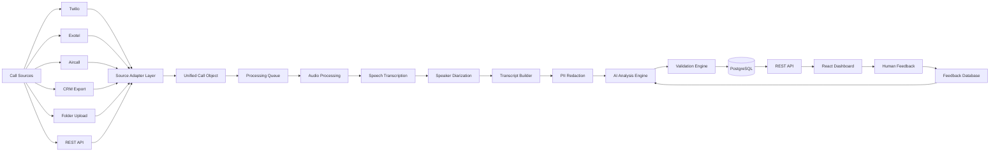

# System Architecture
# FitNova AI Sales Intelligence Platform

**Version:** 1.0  
**Status:** Draft  
**Author:** Tarun Kulkarni

---

# 1. Overview

The FitNova AI Sales Intelligence Platform is designed as a modular, asynchronous AI pipeline that transforms raw sales call recordings into structured business insights.

Instead of tightly coupling the system to one telephony provider or CRM, the platform follows a source-agnostic architecture where every input source is normalized into a common internal format before processing.

The processing pipeline consists of multiple independent stages that communicate through well-defined interfaces, making the system scalable, maintainable, and easy to extend.

---

# 2. High-Level Architecture



---

# 3. Design Principles

The system is designed around the following principles:

- Source independence
- Modular processing
- Asynchronous execution
- Fault tolerance
- Structured AI outputs
- Human-in-the-loop validation
- Easy extensibility
- Separation of concerns

Each processing stage performs one responsibility and produces structured output for the next stage.

---

# 4. End-to-End Processing Pipeline

The complete processing flow consists of the following stages.

## Stage 1 — Call Ingestion

Purpose:

Receive call recordings from multiple configurable sources.

Supported Sources

- Telephony providers
- CRM exports
- Folder uploads
- Direct API uploads

Output

Unified Call Object

Example

```json
{
  "call_id": "CALL_001",
  "advisor_id": "ADV001",
  "team_id": "TEAM01",
  "source": "Folder",
  "audio_path": "/uploads/call001.wav",
  "timestamp": "2026-07-02T10:00:00Z"
}
```

---

## Stage 2 — Source Adapter Layer

The platform never communicates directly with provider-specific APIs.

Instead every provider implements a common adapter interface.

Example

```
Twilio Adapter

↓

Unified Call Object

Exotel Adapter

↓

Unified Call Object

Folder Adapter

↓

Unified Call Object
```

Benefits

- New providers require no downstream code changes.
- Multiple providers can operate simultaneously.
- Simplified testing.

---

## Stage 3 — Processing Queue

All uploaded calls are placed into an asynchronous queue.

Responsibilities

- Background processing
- Retry failed jobs
- Parallel execution
- Prevent blocking uploads

Job States

Queued

↓

Processing

↓

Completed

↓

Failed

↓

Retry

---

## Stage 4 — Audio Processing

Responsibilities

- Validate format
- Convert audio
- Normalize volume
- Remove unsupported formats
- Extract duration

Output

Standard WAV format

---

## Stage 5 — Speech Transcription

Technology

OpenAI Whisper

Responsibilities

- Speech recognition
- Timestamp generation
- Language detection

Output

Timestamped transcript

Example

Advisor

00:00

Good morning, welcome to FitNova.

Customer

00:08

I'm looking to lose weight.

---

## Stage 6 — Speaker Diarization

Technology

pyannote.audio

Responsibilities

Separate speakers.

Output

Advisor

Customer

Confidence score

If confidence is low

↓

Mark transcript for review.

---

## Stage 7 — Transcript Builder

Responsibilities

Merge

Transcription

+

Speaker labels

+

Timestamps

Output

```json
[
  {
    "speaker":"Advisor",
    "start":"00:12",
    "end":"00:18",
    "text":"Tell me about your fitness goals."
  }
]
```

---

## Stage 8 — PII Redaction

Purpose

Protect sensitive customer information.

Detect

- Phone numbers
- Email
- Address
- Payment information

Example

Before

```
9876543210
```

After

```
98XXXXXX10
```

---

## Stage 9 — AI Analysis Engine

Input

Transcript

Output

- Call Summary
- Quality Score
- Issue Tags
- Coaching Suggestions
- Sentiment
- Compliance Evaluation
- Booking Status

Structured JSON only.

---

## Stage 10 — Validation Engine

Every AI response is validated before storage.

Validation includes

- JSON schema
- Required fields
- Timestamp verification
- Quote verification
- Score ranges

Invalid outputs

↓

Retry

---

## Stage 11 — Database Storage

The system stores

- Audio metadata
- Transcript
- Speakers
- Scores
- Tags
- Feedback
- Analytics

PostgreSQL acts as the system of record.

---

## Stage 12 — REST API

Provides data to frontend.

Examples

```
POST /upload

GET /calls

GET /call/{id}

GET /dashboard

POST /feedback
```

---

## Stage 13 — Dashboard

Role-specific dashboards.

Sales Director

Organization metrics

↓

Team Leader

Team metrics

↓

Advisor

Personal metrics

---

## Stage 14 — Human Feedback

Managers can

- Accept AI findings
- Reject findings
- Edit scores
- Correct issue tags

Corrections are stored for future model improvement.

---

# 5. Component Responsibilities

| Component | Responsibility |
|------------|---------------|
| Source Adapter | Normalize external systems |
| Queue | Background execution |
| Audio Processor | Prepare audio |
| Whisper | Speech recognition |
| Pyannote | Speaker identification |
| Transcript Builder | Merge transcript |
| PII Engine | Mask sensitive data |
| AI Engine | Analyze conversation |
| Validator | Validate JSON |
| Database | Persistent storage |
| Dashboard API | Serve frontend |
| Feedback Module | Human correction |

---

# 6. Automation Prioritization

The following stages provide the highest automation value.

| Stage | Automation Benefit |
|--------|-------------------|
| Transcription | Eliminates manual transcription |
| Speaker Diarization | Removes manual labeling |
| AI Analysis | Automates QA review |
| Issue Detection | Finds coaching opportunities |
| Dashboard Generation | Real-time reporting |

Lower priority automation

- Weekly reports
- Email notifications
- Trend prediction

---

# 7. Fault Tolerance

The system is designed to recover from failures.

Examples

Audio Failure

↓

Retry

↓

Failed

↓

Manual Review

API Failure

↓

Exponential Backoff

↓

Retry

↓

Dead Letter Queue

Duplicate Upload

↓

Call ID Exists

↓

Ignore

---

# 8. Idempotency

Every uploaded call receives a globally unique Call ID.

Before processing

System checks

Call Exists?

Yes

↓

Skip Processing

No

↓

Continue

This prevents duplicate analysis.

---

# 9. Retry Strategy

Maximum retries

3

Retry intervals

30 sec

↓

60 sec

↓

120 sec

After final failure

↓

Move to Failed Queue

↓

Visible in Dashboard

---

# 10. Human-in-the-Loop Architecture

```mermaid
flowchart LR

Transcript --> AI

AI --> Score

AI --> Tags

Score --> Reviewer

Tags --> Reviewer

Reviewer --> Corrections

Corrections --> Database

Database --> Prompt Improvement
```

---

# 11. Scalability Strategy

The architecture supports future scaling.

New CRM

↓

New Adapter

New Telephony

↓

New Adapter

New Team

↓

Database Entry

New Advisor

↓

Database Entry

No application changes required.

---

# 12. Security Considerations

- PII redaction before AI analysis where applicable.
- Secure REST APIs.
- Input validation.
- Metadata sanitization.
- Protected file storage.
- Audit logging.
- Role-based access.

---

# 13. Technology Stack

| Layer | Technology |
|--------|------------|
| Frontend | React + TypeScript + Tailwind CSS + shadcn/ui |
| Backend | FastAPI |
| Database | PostgreSQL |
| ORM | SQLAlchemy |
| AI Transcription | Whisper |
| Speaker Diarization | pyannote.audio |
| LLM Analysis | OpenAI GPT-4.1 / GPT-5 |
| Validation | Pydantic |
| Charts | Recharts |
| Background Processing | FastAPI Background Tasks (upgradeable to Celery + Redis) |
| Storage | Local File Storage (prototype) |

---

# 14. Architecture Summary

The FitNova AI Sales Intelligence Platform follows a modular, source-agnostic architecture that cleanly separates ingestion, AI processing, storage, and visualization. Every processing stage is independently replaceable and communicates using structured data contracts, allowing the platform to integrate with multiple telephony providers and CRMs while remaining scalable and maintainable. Human reviewers remain part of the feedback loop, ensuring AI-generated insights can be corrected and continuously improved over time.