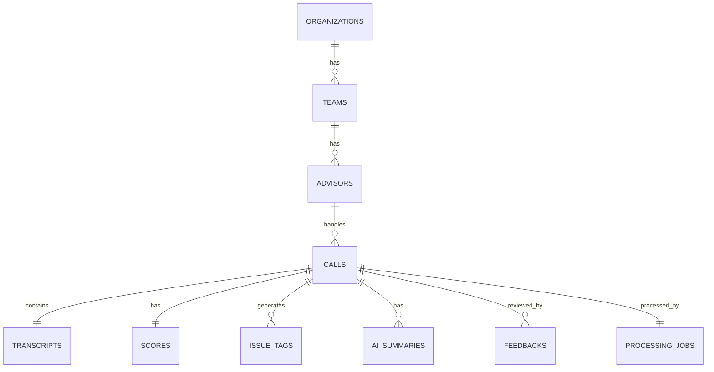

# Database Design
# FitNova AI Sales Intelligence Platform

**Version:** 1.0  
**Status:** Draft  
**Database:** PostgreSQL  
**ORM:** SQLAlchemy  

---

# 1. Overview

The FitNova AI Sales Intelligence Platform stores structured information generated throughout the AI processing pipeline.

The database is designed with the following goals:

- Normalize business entities
- Support organization growth
- Maintain historical call records
- Store AI-generated insights
- Enable analytics dashboards
- Support human feedback
- Avoid vendor lock-in
- Allow future integrations without schema changes

The design follows a relational model with clear entity relationships.

---

# 2. Entity Relationship Diagram

---

# 3. Database Design Principles

The schema follows these principles:

- Third Normal Form (3NF)
- UUID-based primary keys
- Soft deletion support
- Audit timestamps
- Foreign key constraints
- Indexed search fields
- Future multi-tenant support

---

# 4. Organizations Table

Represents a customer organization.

| Column | Type |
|---------|------|
| id | UUID |
| name | VARCHAR(200) |
| industry | VARCHAR(100) |
| created_at | TIMESTAMP |
| updated_at | TIMESTAMP |

Indexes

- Primary Key
- Organization Name

---

# 5. Teams Table

Each organization contains multiple teams.

| Column | Type |
|---------|------|
| id | UUID |
| organization_id | UUID |
| name | VARCHAR(100) |
| description | TEXT |
| created_at | TIMESTAMP |

Relationship

Organization

↓

Many Teams

---

# 6. Advisors Table

Stores advisor information.

| Column | Type |
|---------|------|
| id | UUID |
| team_id | UUID |
| employee_code | VARCHAR(50) |
| name | VARCHAR(150) |
| email | VARCHAR(150) |
| phone | VARCHAR(20) |
| status | VARCHAR(30) |
| created_at | TIMESTAMP |

Relationship

Team

↓

Many Advisors

---

# 7. Calls Table

Stores uploaded call metadata.

| Column | Type |
|---------|------|
| id | UUID |
| advisor_id | UUID |
| source_type | VARCHAR(50) |
| source_reference | VARCHAR(255) |
| audio_file | TEXT |
| audio_duration | INTEGER |
| language | VARCHAR(50) |
| upload_time | TIMESTAMP |
| processing_status | VARCHAR(30) |
| created_at | TIMESTAMP |

Processing Status

- Uploaded
- Queued
- Processing
- Completed
- Failed

Indexes

- Advisor
- Status
- Upload Time

---

# 8. Processing Jobs

Tracks AI processing lifecycle.

| Column | Type |
|---------|------|
| id | UUID |
| call_id | UUID |
| stage | VARCHAR(100) |
| status | VARCHAR(30) |
| retry_count | INTEGER |
| error_message | TEXT |
| started_at | TIMESTAMP |
| completed_at | TIMESTAMP |

Purpose

- Retry handling
- Failure tracking
- Monitoring

---

# 9. Transcript Table

Stores final merged transcript.

| Column | Type |
|---------|------|
| id | UUID |
| call_id | UUID |
| speaker | VARCHAR(30) |
| start_time | FLOAT |
| end_time | FLOAT |
| text | TEXT |
| confidence | DECIMAL(5,2) |

Example

Advisor

↓

00:15

↓

00:21

↓

Tell me about your fitness goals.

---

# 10. Call Scores Table

Stores AI evaluation scores.

| Column | Type |
|---------|------|
| id | UUID |
| call_id | UUID |
| rapport_score | INTEGER |
| needs_discovery_score | INTEGER |
| objection_handling_score | INTEGER |
| product_knowledge_score | INTEGER |
| compliance_score | INTEGER |
| closing_score | INTEGER |
| trial_booking_score | INTEGER |
| overall_score | INTEGER |
| created_at | TIMESTAMP |

Range

0–100

---

# 11. Issue Tags Table

Stores every issue detected by AI.

| Column | Type |
|---------|------|
| id | UUID |
| call_id | UUID |
| category | VARCHAR(100) |
| severity | VARCHAR(20) |
| timestamp | FLOAT |
| speaker | VARCHAR(30) |
| quote | TEXT |
| reason | TEXT |
| confidence | DECIMAL(5,2) |

Severity

- Low
- Medium
- High
- Critical

Example

Pressure Selling

Critical

08:12

Advisor

"Offer expires today."

Artificial urgency.

---

# 12. AI Summaries Table

Stores generated summaries.

| Column | Type |
|---------|------|
| id | UUID |
| call_id | UUID |
| executive_summary | TEXT |
| customer_goal | TEXT |
| objections | TEXT |
| recommended_next_step | TEXT |
| sentiment | VARCHAR(30) |
| created_at | TIMESTAMP |

---

# 13. Feedback Table

Stores human corrections.

| Column | Type |
|---------|------|
| id | UUID |
| call_id | UUID |
| reviewer_name | VARCHAR(150) |
| feedback_type | VARCHAR(50) |
| original_value | TEXT |
| corrected_value | TEXT |
| comments | TEXT |
| reviewed_at | TIMESTAMP |

Feedback Types

- Score
- Tag
- Summary
- Transcript

---

# 14. Supported Source Adapters

Tracks configured ingestion sources.

| Column | Type |
|---------|------|
| id | UUID |
| provider_name | VARCHAR(100) |
| adapter_type | VARCHAR(50) |
| status | VARCHAR(30) |
| configuration | JSONB |
| created_at | TIMESTAMP |

Example

Twilio

Exotel

Folder

REST API

CRM Export

---

# 15. Relationships Summary

Organization

↓

Many Teams

↓

Many Advisors

↓

Many Calls

↓

One Transcript

↓

One Score

↓

Many Issue Tags

↓

One Summary

↓

Many Feedback Entries

↓

One Processing Job

---

# 16. Indexing Strategy

Indexes improve dashboard performance.

Calls

- advisor_id
- processing_status
- upload_time

Transcript

- call_id
- speaker

Scores

- overall_score

Issue Tags

- severity
- category

Feedback

- call_id

---

# 17. Data Retention Strategy

Call Audio

Retained until manually deleted.

Transcript

Retained permanently.

Scores

Retained permanently.

Issue Tags

Retained permanently.

Feedback

Retained permanently.

Audit timestamps allow future archival policies.

---

# 18. Scalability Considerations

The schema supports:

- Multiple organizations
- Unlimited teams
- Unlimited advisors
- Millions of calls
- Multiple telephony providers
- Future CRM integrations
- Future AI model versions

No schema redesign is required when onboarding new organizations.

---

# 19. Sample Data Flow

Call Uploaded

↓

Calls Table

↓

Transcript Generated

↓

Transcript Table

↓

AI Analysis

↓

Scores Table

↓

Issue Tags Table

↓

Summary Table

↓

Dashboard

↓

Reviewer Feedback

↓

Feedback Table

---

# 20. Database Summary

The database schema provides a scalable foundation for storing call recordings, transcripts, AI-generated insights, organizational hierarchies, and human feedback. The normalized design minimizes redundancy while enabling efficient reporting, analytics, and future feature expansion. It directly supports all core requirements of the FitNova Sales Intelligence Platform and serves as the primary persistence layer for the end-to-end AI pipeline.