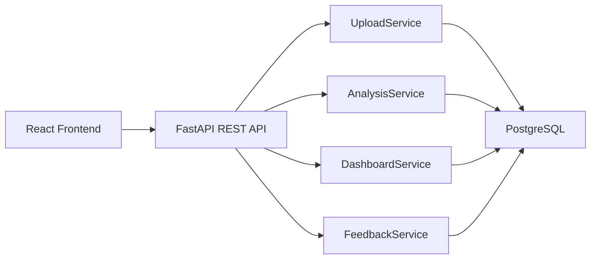
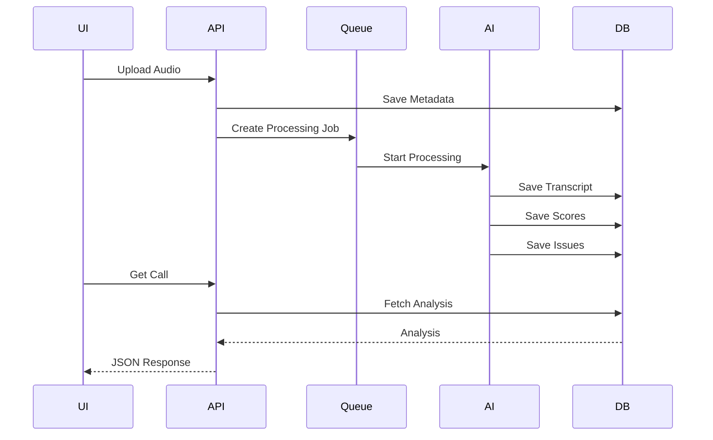

# API Design
# FitNova AI Sales Intelligence Platform

**Version:** 1.0  
**Status:** Draft  
**Architecture Style:** RESTful API  
**Backend Framework:** FastAPI  
**Data Format:** JSON

---

# 1. Overview

The FitNova AI Sales Intelligence Platform exposes REST APIs for uploading call recordings, managing AI processing, retrieving analysis results, collecting human feedback, and powering role-based dashboards.

The APIs are designed to be:

- RESTful
- Stateless
- Source-agnostic
- Versionable
- Secure
- Easy to integrate with different frontend applications

All responses are returned in JSON format.

---

# 2. API Architecture



---

# 3. API Versioning

All APIs are versioned.

```
/api/v1/
```

Example

```
POST /api/v1/calls/upload
```

Future versions

```
/api/v2/
```

---

# 4. Authentication (Prototype)

For the assignment prototype, authentication is simplified.

Supported roles:

- Sales Director
- Team Leader
- Advisor

Future versions may use:

- JWT
- OAuth2
- SSO

---

# 5. Standard Response Format

Every API follows a common response structure.

Success

```json
{
  "success": true,
  "message": "Operation completed successfully.",
  "data": {}
}
```

Failure

```json
{
  "success": false,
  "message": "Validation failed.",
  "errors": []
}
```

---

# 6. Call Upload APIs

## Upload Call

**POST**

```
/api/v1/calls/upload
```

Purpose

Uploads a new sales call recording.

Request

Multipart Form Data

Fields

| Field | Type | Required |
|--------|------|----------|
| audio | File | Yes |
| advisor_id | UUID | Yes |
| team_id | UUID | Yes |
| source | String | Yes |

Success Response

```json
{
  "success": true,
  "call_id": "CALL001",
  "status": "Queued"
}
```

Status Codes

| Code | Meaning |
|------|----------|
| 201 | Created |
| 400 | Invalid Input |
| 500 | Internal Error |

---

## Get All Calls

**GET**

```
/api/v1/calls
```

Query Parameters

| Parameter | Description |
|------------|-------------|
| page | Pagination |
| advisor_id | Filter |
| team_id | Filter |
| status | Filter |

Response

```json
{
  "calls":[]
}
```

---

## Get Call Details

**GET**

```
/api/v1/calls/{call_id}
```

Returns

- Metadata
- Transcript
- Scores
- Issue Tags
- Summary
- Coaching Tips

---

## Delete Call

**DELETE**

```
/api/v1/calls/{call_id}
```

Purpose

Deletes a call and associated records.

---

# 7. Processing APIs

## Get Processing Status

**GET**

```
/api/v1/processing/{call_id}
```

Response

```json
{
    "status":"Processing",
    "current_stage":"Speaker Diarization",
    "progress":62
}
```

Possible Status

- Uploaded
- Queued
- Processing
- Completed
- Failed

---

## Retry Processing

**POST**

```
/api/v1/processing/{call_id}/retry
```

Purpose

Retries failed jobs.

---

# 8. Transcript APIs

## Get Transcript

**GET**

```
/api/v1/transcripts/{call_id}
```

Returns

- Speaker
- Timestamp
- Text
- Confidence

Example

```json
[
    {
        "speaker":"Advisor",
        "start":10,
        "end":15,
        "text":"Welcome to FitNova."
    }
]
```

---

# 9. Analysis APIs

## Get AI Analysis

**GET**

```
/api/v1/analysis/{call_id}
```

Returns

- Summary
- Scores
- Issues
- Sentiment
- Coaching
- Booking Status

---

## Re-analyze Call

**POST**

```
/api/v1/analysis/{call_id}/reanalyze
```

Purpose

Runs AI analysis again.

Useful after prompt improvements.

---

# 10. Dashboard APIs

## Organization Dashboard

**GET**

```
/api/v1/dashboard/organization
```

Returns

- Total Calls
- Average Score
- Team Rankings
- Critical Issues
- Daily Trend

---

## Team Dashboard

**GET**

```
/api/v1/dashboard/team/{team_id}
```

Returns

- Team Score
- Advisor Ranking
- Coaching Opportunities
- Weekly Trend

---

## Advisor Dashboard

**GET**

```
/api/v1/dashboard/advisor/{advisor_id}
```

Returns

- Personal Score
- Previous Calls
- Improvements
- AI Feedback

---

# 11. Feedback APIs

## Submit Feedback

**POST**

```
/api/v1/feedback
```

Purpose

Allows human reviewers to correct AI output.

Request

```json
{
    "call_id":"CALL001",
    "feedback_type":"Issue",
    "original_value":"Pressure Selling",
    "corrected_value":"None",
    "comment":"No urgency used."
}
```

Response

```json
{
    "success":true
}
```

---

## Get Feedback History

**GET**

```
/api/v1/feedback/{call_id}
```

Returns

Complete review history.

---

# 12. Health APIs

## Health Check

**GET**

```
/api/v1/health
```

Response

```json
{
    "status":"Healthy"
}
```

---

# 13. Error Handling

Standard HTTP Codes

| Code | Description |
|------|-------------|
| 200 | Success |
| 201 | Created |
| 400 | Bad Request |
| 401 | Unauthorized |
| 403 | Forbidden |
| 404 | Not Found |
| 409 | Duplicate Upload |
| 422 | Validation Failed |
| 429 | Too Many Requests |
| 500 | Internal Server Error |

---

# 14. Validation Rules

Upload API

- Audio must exist
- Supported formats only
- Advisor ID required
- Team ID required

Feedback API

- Valid Call ID
- Feedback Type Required

Analysis API

- Call must exist
- Processing Completed

---

# 15. API Flow



---

# 16. API Security

The production version should support:

- JWT Authentication
- HTTPS
- Rate Limiting
- Request Validation
- Input Sanitization
- File Type Validation
- Maximum Upload Size

For this prototype, authentication will be mocked to focus on the AI workflow.

---

# 17. Future APIs

Future enhancements may include:

- Webhook APIs
- CRM Integration APIs
- Bulk Upload APIs
- Real-Time Streaming APIs
- Analytics Export APIs
- User Management APIs
- Notification APIs

---

# 18. API Summary

The API layer provides a clean and scalable interface between the frontend, AI processing pipeline, and database. Each endpoint follows consistent request and response formats, enabling easy integration, future extensibility, and reliable communication between all system components. The design supports asynchronous processing, role-based dashboards, human feedback, and source-agnostic ingestion while remaining aligned with modern REST API best practices.