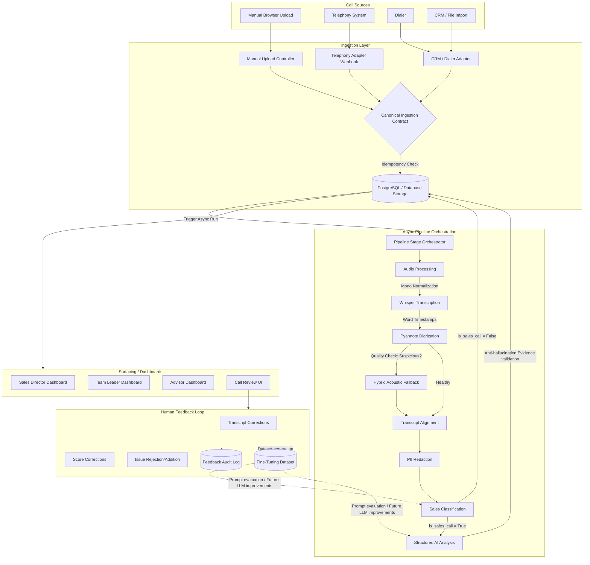

# FitNova Sales Intelligence — System Design Documentation

This document describes the end-to-end architecture of the FitNova Sales Intelligence platform, including its data flows, models, pipelines, and human feedback loops.

---

## 1. System Architecture Diagram



---

## 2. Technical Walkthrough

### A. Ingestion Layer
The system implements a unified ingestion abstraction using the **Canonical Ingestion Contract** defined in [ingestion.py](file:///c:/Users/91963/OneDrive/Desktop/fitnova-sales-intelligence/backend/app/schemas/ingestion.py):
* All external systems (dialers, telephony logs, CRM imports, manual browser uploads) normalize their data payloads into this contract.
* **Idempotency Protection**: Enforced using `source_type` and `source_reference` (external ID) at the service level. Duplicates are rejected with an `HTTP 409 Conflict` status, preventing duplicate charges or storage overhead. Manual browser uploads without external IDs remain fully supported and bypass reference checks.
* **Telephony Example Adapter**: Exposed via `/api/v1/ingestion/telephony` as a lightweight webhook proving that any external provider can normalize into the unified ingestion path without modifying downstream components.

### B. Audio Processing & Transcription
* **Mono Audio & Sample Rate Normalization**: Incoming call recordings are loaded via `Pydub`, gain-normalized, downsampled to 16kHz, and merged to mono format. This guarantees high accuracy for speech models downstream.
* **Whisper Transcription**: Local OpenAI Whisper engines run transcription with word-level timestamps (`word_timestamps=True`). Automatic language detection supports multilingual and **Hinglish** speech without forcing English translation, preserving the original spoken language.

### C. Speaker Diarization & Hybrid Fallback
* **Primary Path**: Pyannote speaker diarization groups speech tracks.
* **Heuristic Suspicious Check**: If Pyannote outputs coarse speaker segmentation (e.g. fewer than 5 turns for conversational calls or single turns $> 15$ seconds containing multiple silence gaps/sentence boundaries), the pipeline automatically triggers the acoustic fallback.
* **Hybrid Fallback Algorithm**:
  1. Chunk raw Whisper words on sentence-ending punctuation (`.?!`), silence gaps ($\ge 0.4$s), or max duration ($5.0$s), preserving commas and semicolons.
  2. Extract speaker embeddings using `pyannote/wespeaker-voxceleb-resnet34-LM`.
  3. Cluster embeddings into 2 groups using cosine AgglomerativeClustering.
  4. Assign short replies ($< 0.5$s) using a strict priority: direct embedding validation $\rightarrow$ centroid similarity $\rightarrow$ Pyannote boundary overlap $\rightarrow$ closest temporal neighbor.
  5. Reconstruct speaker turns chronologically and merge adjacent turns.

### D. Analysis, Validation, & Anti-Hallucination
* **Classification**: Submits the redacted transcript to the classifier provider before sales analysis. Deterministic rules (e.g., test keyword markers) act as overrides. Non-sales calls bypass quality scoring and issue tags, persisting only the classification reasoning, classification confidence, and a neutral summary.
* **Sales Quality Scoring**: Evaluates calls across 7 weighted dimensions (Rapport, Needs Discovery, Product Knowledge, Objection Handling, Compliance, Trial Booking, Closing).
* **Anti-hallucination Validation**: Every detected issue tag must undergo evidence verification. If the quoted quote cannot be verified inside the transcript, the tag is rejected or corrected.

### E. Database Persistence
* All data is persisted in PostgreSQL (production) or SQLite (dev/testing).
* Database write operations are fully transaction-safe. If any stage is re-run, existing transcripts, summaries, scores, and issue tags for that call are deleted first, ensuring idempotency and zero duplicate data.

### F. Human Feedback Loop
Advisors and managers can review transcripts, scores, summaries, and issue tags on the **Call Review UI**.
* Corrections (rejection of false positives, adding missed issues, adjusting scores, correcting words) are logged in the **Feedback Audit Log**.
* Approved corrections populate a **Fine-Tuning Dataset**, which is evaluated to optimize future prompt instructions or fine-tune models to prevent future regressions.

---

## 3. Scaling Path to Production

### Current Demo Architecture
* Synchronous FastAPI worker threads executing pipeline stages using simple asyncio background tasks.
* Local SQLite file or unified PostgreSQL database.
* Local CPU-based Whisper and Pyannote execution.
* Local disk-based transcript storage.

### Production Evolution Path
```
Telephony / Uploads 
    ↓
Nginx Load Balancer 
    ↓
FastAPI Web App (Stateless Container Registry)
    ↓
RabbitMQ / Redis Queue
    ↓
Distributed Celery Workers (with CUDA GPU acceleration for transcription & diarization)
    ↓
PostgreSQL Cluster (Primary/Replica) + AWS S3 / Cloud Audio Storage
```

1. **Task Queue Orchestration**: Transition task dispatching to **Celery** with **RabbitMQ** or **Redis** to scale background workers horizontally and decouple HTTP endpoints from heavy ML workloads.
2. **GPU Acceleration**: Deploy distributed workers on GPU-accelerated cloud nodes (e.g. AWS EC2 with NVIDIA T4) to reduce Whisper/Pyannote runtime from minutes to seconds.
3. **High Availability Database**: Migrate PostgreSQL to a managed multi-AZ cluster with replica read-nodes for analytics queries, and index tables on `upload_time` and scopes.
4. **Cloud Object Storage**: Save raw/processed audio files and JSON artifacts in **AWS S3** or equivalent cloud storage with access control lists (ACL) instead of local filesystems.
